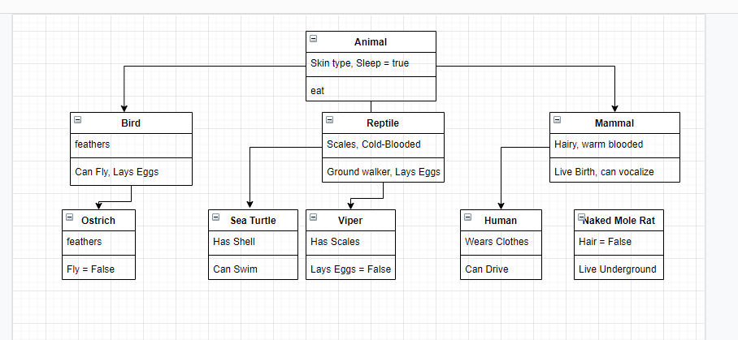
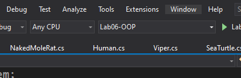
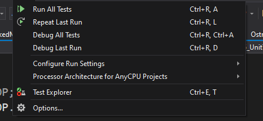
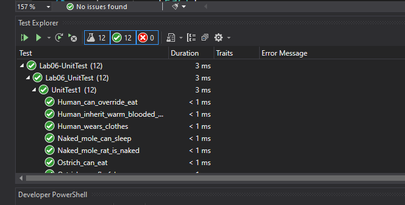

# Lab06-OOP
[Link to code]

This project was designed to have me create multiple classes and use inheritance to inherit and overrider with different concrete animals. 
It is a zoo of animals. 

# Instructions
Using UML, diagram what animals the zoo will consist of. Include in each class the properties and behaviors for each animal, as well as the relationships between each animal from it’s base classes.

Next, create a new console application that will instantiate each of your concrete animals, and prove that they are inheriting traits/features from their various parent classes.

Your lab should showcase all 4 of the Object-Oriented Principles (OOPs).

Implement each of the classes you showcased in your UML within Visual Studio.  
There should be at least 3 layers of inheritance with at least 5 different types of animals.  
Prove that the behaviors for each class exist or were properly inherited by returning strings as necessary .  
Some example methods could be: Eat() Sleep() Sound() etc…  
You are allowed to use these example methods within your lab, along with others not listed  
Include the following labels:  
- Label the parent and derived classes  
- Label the abstract classes and concrete classes
- Label the access modifiers for each of the classes
- Label where you are using polymorphism in your program. Identify where the virtual and abstract methods are defined, and where are they being overridden.
Your program class should instantiate each of the concrete animals to prove the functionality of it’s base classes.

#Program Specifications  
Your solution should include the following:

- Have at least 3 different abstract classes
- Have at least 3 layers of inheritance
- Have at least 5 concrete animals
- Have at least 2 abstract methods (make sure you override them)
- Have at least 2 abstract Properties (make sure you override them)
- Have at least 2 virtual methods (make sure you override at least one of them)
- Have at least 2 virtual properties (make sure you override at least one of them)
- Your (digital) drawing of your zoo diagram should be clearly labeled  
NOTE: You are not required to be scientifically correct with your animal names. Keep the names of your animals simple. For example you do not need to label your animals anything more complicated than Mammal, Reptile, Cat, Bird, etc…

Here is a drawing of my UML. 

  

This was an Object Oriented Programming project. The OOP principles used were:
- Inheritance 
    - This is used by having a child class inherit traits or properties from its parent or grand-parent class
        - An exmaple of a time when I used this is when the SeaTurtle class inherits the eat trait of the Animal class.
- Abstractraction
    - This is used to hide internal implementation of details. 
        - This was used when I created my abstract classes for all my different elements of my UML.
- encapsulation
    -   is sued to hide details from the user
        - I did this by declaring my methods and classes public. Allowing others to see them. 

# Lab 07

[Link to code]

### Instructions  
Create a minimum of 2 interfaces.
Each interface created should be implemented by more than one class.
Have at least one class implement more than one interface
Test your code with Unit testing
Label interfaces as <interface>
Do not implement your interfaces on your highest base class. The interfaces should be scattered among the application.

When running your application, it should output each of the concrete animals and one behavior that it has inherited without any direct code manipulation

### Unit Tests  
Test that your program has the following functionality:

Test that the classes that implement the interface actually implement it
Test inheritance
Test Polymorphism
Prove methods have been overridden
Prove that one of your concrete animals is an Animal

### How to run tests

1. Click the Tests button at the top  

2. Click "Run All Tests"  
  

3. Watch as the tests run!  

